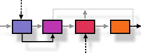
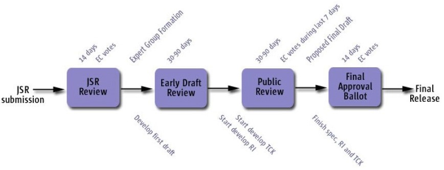

<table width="100%" border="0" cellspacing="0" cellpadding="0">
<tr>
<th><h2>Welcome to the JCP Executive Committee project</h2></th>
<th> </th>
</tr>
</table>

[JSR 348: Towards a new version of the Java Community Process](http://jcp.org/en/jsr/detail?id=348) requires the JCP's Executive Committee to operate in a transparent manner. 

This project will be used to host materials and communications to enable JCP members and the public to more fully understand and participate in our work.

Over time, materials that are currently posted at jcp.org will be migrated here. In the meantime, here are some links to get you started.

* As required by JSR 348 we have created a ''Discussion'' mailing list that you can use to discuss EC matters and to provide feedback to the EC. Go <a href="http://java.net/projects/jcp-ec/lists">here</a> to subscribe. (You'll need a java.net login to subscribe. Messages from non-subscibers are silently ignored.) 
* Other useful links:
** <a href="https://github.com/jcp-org/jcp-ec/issues">Our Issue Tracker</a>.
** <a href="http://jcp.org/en/participation/committee">List of Executive Committee members and other EC information</a>.
** <a href="http://jcp.org/en/resources/EC_summaries">Meeting minutes and materials</a>.
** <a href="https://github.com/jcp-org/jcp-ec/pages/DocumentIndex">Document archive</a>.
----

